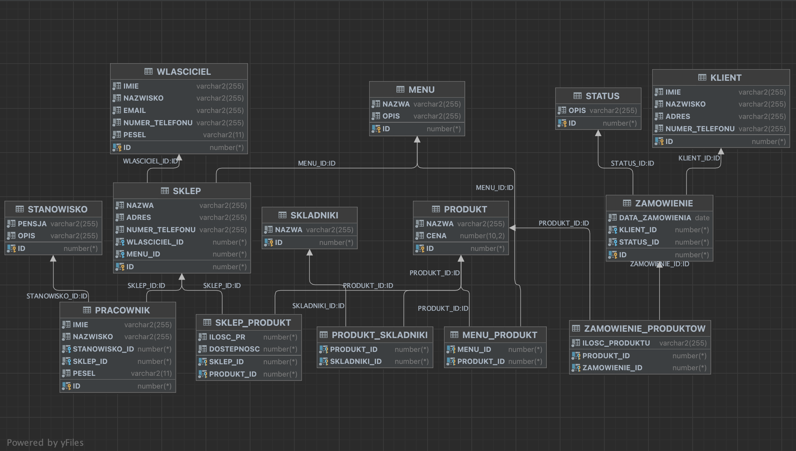

# SQL Project: Restaurant Management System

This SQL project involves the creation of a restaurant management system database using a series of SQL scripts. The project defines multiple tables to store information about customers, menus, products, ingredients, employees, orders, owners, and more. It simulates a basic database for managing a restaurant's operations, including handling orders, inventory, and personnel information.

## Table of Contents

- [Project Description](#project-description)
- [Table Structure](#table-structure)
- [Sample Queries](#sample-queries)
- [Triggers](#triggers)
- [Contributors](#contributors)
- [License](#license)

## Project Description

The project's main goal is to create a comprehensive database system that assists in managing various aspects of a restaurant, such as customer information, menu items, employee details, and order records. The database schema includes tables for clients, menus, products, ingredients, employees, orders, owners, and more. The tables are interconnected using foreign key relationships to maintain data integrity and ensure smooth operations.

## Table Structure

The project defines the following tables and their corresponding attributes:

- Klient (Client)
- Menu
- Menu_Produkt (Menu_Product)
- Pracownik (Employee)
- Produkt (Product)
- Produkt_Skladniki (Product_Ingredients)
- Skladniki (Ingredients)
- Sklep (Store)
- Sklep_Produkt (Store_Product)
- Stanowisko (Position)
- Status
- Wlasciciel (Owner)
- Zamowienie (Order)
- Zamowienie_Produktow (Order_Products)

Each table has specific fields to store relevant information. Relationships between tables are established using foreign key constraints to ensure data consistency and accuracy.

## Sample Queries

The project includes various sample queries to demonstrate the database's functionality, including:

- Joining tables to retrieve combined information (e.g., orders and customer details)
- Aggregating functions to calculate averages and sums (e.g., average product price)
- Subqueries to retrieve specific data subsets (e.g., customers with orders)
- Correlated subqueries to link data across multiple tables (e.g., employees in stores managed by a specific owner)

## Triggers

Triggers are implemented to enforce business rules and maintain data integrity:

- A BEFORE INSERT trigger for the "Klient" table ensures that each client's phone number is unique.
- A BEFORE UPDATE trigger for the "Produkt" table prevents the product's price from being lowered.
- An AFTER DELETE trigger for the "Zamowienie" table displays information about deleted orders.
- An AFTER INSERT trigger for the "Skladniki" table updates the "Produkt_Skladniki" table after adding a new ingredient.

## Contributor

- Valerii Andriushchenko

Feel free to contribute to this project by submitting pull requests or reporting issues.

## License

This project is licensed under the MIT License.

This README provides an overview of the SQL project. For detailed SQL scripts and implementation, refer to the SQL script files in the repository.
